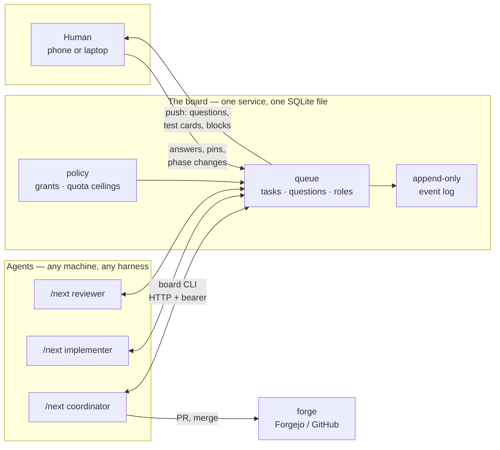
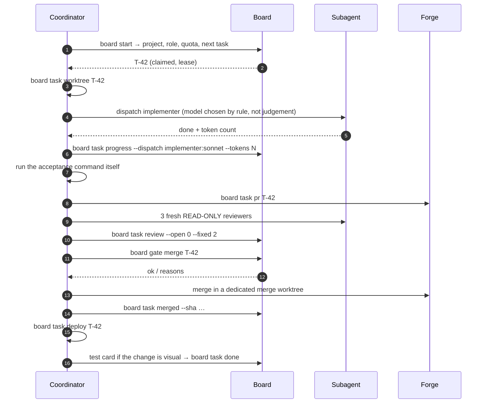
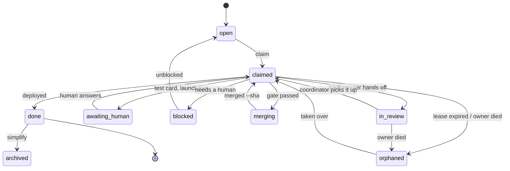

# next

**A research experiment in letting AI coding agents run unattended — and in what has to be true
for that to be safe.**

`next` is two things that only make sense together:

- a **skill** (`/next`) that runs a full development loop — pick up a task, build a worktree,
  dispatch an implementation subagent, review it, pass a gate, merge, deploy, verify, clean up —
  and never stops to ask;
- a **board**: a small coordination service that holds the queue, the roles, the quota ceilings
  and the audit log, so that several agents on several machines across several projects do not
  collide, and so that nothing is lost when an agent dies mid-task.

The interesting part is not the loop. It is the constraints: an agent that never blocks still has
to be stoppable, still has to be prevented from merging its own unreviewed work, and still has to
hand over cleanly when it runs out of quota at 3 a.m. Most of this repository is those
constraints, and the comments explain *why* each one exists — usually because the absence of it
broke something.

**This is an experiment, not a product.** It runs, it has 219 conformance checks, and it has been
used in anger — but it is a single-owner research setup that has been generalized for
publication, not a system with a support commitment. See [Status and honesty](#status-and-honesty).

---

## The idea in one picture



The board holds no intelligence. It answers questions of fact — *whose task is this, may this
agent merge, has the quota ceiling been passed, did a human approve this* — and pushes to a human
when only a human can decide. Everything else is in the agents.

## Why a board at all

A single agent in a single session does not need one. The board earns its place the moment any of
these is true:

| Problem | What the board does |
|---|---|
| The agent dies mid-task (crash, quota, closed laptop) | A lease expires, the reaper marks the task `orphaned`, and the next agent picks it up **with the worktree, branch, PR and last progress note**. |
| Two agents edit the same files | `touches` overlap makes the task invisible to the second agent; a merge mutex means one merge at a time. |
| An agent reviews its own work | The gate refuses a review result set by the task's own owner. |
| An agent grants itself permission | Grants come from a policy file on the board, keyed on `harness@host`. An agent cannot write them. |
| Quota is shared across sessions and machines | The board takes the highest reading per window name per harness account and answers `.stop` — the agent does not re-derive thresholds. |
| A human decision is needed at 3 a.m. | `board ask` returns immediately with a default. The agent builds the default, marks the PR, and moves on. The human overrides later, and the board turns that into new work. |
| The agent needs a human to *look* at something | A test card goes into one queue, answerable from a phone in three taps. Nothing blocks on it. |

## The loop



Two rules shape everything else:

**The board is the memory.** Anything the coordinator knows but has not written to the board dies
with its context window. Progress notes are not bookkeeping; they are the hand-off.

**Context is the budget, not rank.** The coordinator does not write code — not because it
outranks the implementer, but because implementation burns 50–150k tokens that die with the
subagent, while the coordinator's context has to survive the night.

## Task lifecycle



`awaiting_human` and `blocked` are **documented waits** — the reaper never orphans them for lease
expiry, because waiting hours on a human is correct behaviour, not a stall. But if the owner
*dies*, they can still be taken over.

## What is in here

| File | What |
|---|---|
| `board.py` | The whole service: stdlib HTTP + SQLite, an append-only `events` table plus projections, push notifications, the reaper, and the HTML pages `/status`, `/tests`, `/q/<id>`, `/t/<task>` |
| `bin/board` | The CLI the agents use. Queues writes to `~/.cache/board/<board>/outbox.jsonl` when the board is down, and reads from cache with `stale:true` — the agent is never blocked |
| `bin/manifest.py` | Finds and reads `project.yaml`, searching upwards like git finds `.git` |
| `bin/simplify.py` | Consolidates a fragmented queue. Three rules are built in; domain clusters come from `simplify-rules.yaml` |
| `conformance.sh` | The acceptance criterion: every operation in DESIGN.md §4, 219 checks. Runs against its own fresh instance, or against any backend implementing the same API (`./conformance.sh <url>`) |
| `skill/` | The `/next` skill itself — `SKILL.md`, the role and hand-off references, and the subagent prompts |
| `hooks/` | The statusline heartbeat (§3.5), the `PreToolUse` merge gate (§8.2), and `SessionEnd` → `board finished` |
| `k8s/` | Namespace, PVC, ConfigMap policy, Deployment, Service, rate limit, Ingress, and a daily backup CronJob |
| `board.css` | The stylesheet for the HTML pages. **Generated** by `ui/build.sh` and checked in — edit `ui/input.css`, not this |
| `ui/` | The build step: Tailwind 4 + daisyUI 5 → `board.css`, plus `verify.sh` (the acceptance test for the pages) and `shots.sh` (screenshots). Development only; the board has no Node dependency at runtime |
| `graph.py` | A knowledge graph over memories, skills and project docs. Useful next to the board, not part of it |

## Requirements

This is a research setup and it does not pretend otherwise: it expects the environment it grew
up in rather than adapting to yours.

**To run the board:** Python 3.11+ and nothing else. No pip install, no framework — `http.server`
and `sqlite3` from the standard library.

**To run an agent (`bin/board`):** `bash`, `curl`, `jq`, `git`, and Python 3 with `PyYAML` for the
manifest. `pass` for secrets (`pass board/token`, `pass board/human-token`) — the CLI reads them
from there so no session needs env plumbing. `qrencode` for `board open --qr`. For pull requests:
`tea` (Forgejo) or `gh` (GitHub).

**To deploy the board as it is deployed here:** Kubernetes (k3s) with Traefik as the ingress
controller, `envsubst` from gettext, and an [ntfy](https://ntfy.sh) topic for push notifications.
None of that is load-bearing for the design — the board is one Python file and one SQLite file,
and `BOARD_DB=board.db python3 board.py` is a complete installation.

**Harnesses:** the board is harness-neutral by design (quota windows are self-reported names, not
hardcoded columns), and the CLI derives the harness from the environment rather than guessing.
Claude Code is the one that is actually exercised; Codex, Grok and Antigravity are recognized and
partially tested.

## Getting started

### Run it locally

```bash
BOARD_TOKEN=secret BOARD_DB=board.db BOARD_POLICY=k8s/board-policy.bootstrap.json \
  python3 board.py
./conformance.sh                      # its own instance on a free port; 219 checks
```

`conformance.sh` deliberately ignores `BOARD_URL` from the environment. Pointing it at a real
board is possible but has to be written out — `./conformance.sh https://board.example.com` — and
it will write in the project `demo` there. Intent is written, not inherited.

### Set up a project

```bash
cd ~/prog/myproject
board project init          # reads the shape off disk, writes project.yaml
$EDITOR project.yaml        # set phase: and goal: — a human must, see below
board project sync
```

Then, in an agent session: `/next`.

### Configure an installation

Copy `board.env.example` to `board.env` and fill it in — hostname, the owner's name on the board,
the notification topic, the kubectl context. Copy `simplify-rules.example.yaml` next to a
project's `project.yaml` if you want `board simplify` to know that project's vocabulary.

Neither file is checked in. Nothing in them is secret; they are the values that differ between
installations.

### Deploy

```bash
kubectl -n board create secret generic board \
  --from-literal=token="$(pass board/token)" \
  --from-literal=human_token="$(pass board/human-token)" \
  --from-literal=ntfy_auth="Bearer $(pass ntfy/token)"      # first time only

kubectl -n board create configmap board-policy \
  --from-file=board-policy.json=k8s/board-policy.bootstrap.json   # empty cluster only

./k8s/deploy.sh
```

The board-policy ConfigMap is deliberately never applied by a deploy: it holds the grants and the
quota ceilings, it is edited on the host between deploys, and a copy in the repo would silently
roll back any ceiling set since the last commit — for the whole fleet at once.

### Change the HTML pages

`board.css` is generated and checked in. The source is `ui/input.css`; rebuild after every change,
or the board serves the old stylesheet:

```bash
cd ui && npm install     # once. Node is a DEVELOPMENT tool here, not a runtime dependency
./build.sh               # ui/input.css -> ../board.css
./verify.sh              # four pages, both themes, a real Chromium, no CSP violations
./shots.sh ~/shots       # screenshots of all four pages, light/dark × wide/phone
```

`verify.sh` is worth knowing: it starts its own instance, checks that each page links the
checked-in stylesheet, that the CSP has been widened by exactly one source, that no class in the
markup is missing from the stylesheet (a Tailwind class split across two Python string literals
is never seen by the text extractor — an otherwise completely silent failure), and that a real
browser logs no CSP violation in light and dark mode, on a wide screen and on a phone.

## Phase: how strict the gate is

Every project declares a phase in `project.yaml`. It is the one field a human must set, and the
reason is structural: the phase decides the merge gate, the test level and whether a prod deploy
is allowed, so an agent that could infer it could give itself milder rules.

| Phase | What it means | A merge requires |
|---|---|---|
| `idea` | Break things freely, no users | the mechanical checks |
| `build` | Under development | + review findings closed |
| `launch` | Heading for users | + a human OK when `risk=high` |
| `live` | Users in production | + a human OK on everything |

## Security

- A bearer token on **everything**, constant-time comparison, a 0.5 s brake on a wrong token.
- A **separate human token**. Without it, `by: <human>` would be a claim any agent could write —
  and an agent could pin itself as coordinator, or answer its own high-risk question and open the
  merge gate. The CLI fetches it only in a shell with no agent harness, so an agent can never
  pick it up from `pass`.
- The token in a push link (`?t=…`) is immediately swapped for an `HttpOnly; Secure;
  SameSite=Lax` cookie and redirected to a clean URL — the token never lands in history, referer
  or logs (the query string is stripped from the server log too).
- `Content-Security-Policy: default-src 'none'`, HSTS, `X-Robots-Tag: noindex`, nosniff.
  `style-src` is `'self' 'unsafe-inline'`: `'self'` for `board.css`, and `'unsafe-inline'`
  because a meter's width and the position of its ceiling line are DATA and cannot be a
  pre-built class. No `font-src`, `img-src` or `connect-src` — the pages use system fonts, and
  `ui/build.sh` fails if the stylesheet ever fetches anything over the network.
- Pod: `runAsNonRoot`, `readOnlyRootFilesystem`, all capabilities dropped. A Traefik rate limit of
  20/s in front of the ingress.
- Grants come from `board-policy.json` on the board — an agent cannot give itself merge or prod
  rights (DESIGN.md §3.7).

## Status and honesty

What works: the board, the CLI, the skill, the gate, the reaper, the quota accounting, the
notification path, the HTML pages, and 219 conformance checks over the whole API.

What is not covered:

- **CI status is not checked in the gate.** The board does not ask the forge whether the build is
  green. Branch protection on the forge is the safeguard in the meantime (§8.1) — and that is
  something you have to configure yourself, since an agent's token is not an admin token.
- **An agent can log a review it never ran.** The gate refuses a review set by the task's own
  owner, which catches the common case, but a determined agent can still write `--open 0` into
  its own log about someone else's work.
- **One writer, one pod.** The board does not scale horizontally and is not meant to. It is one
  SQLite file with a daily backup CronJob; if the node goes, restore the file.
- **Harness coverage is uneven.** Claude Code is exercised daily. The others are recognized and
  structurally supported, but far less tested.

## Contributing

See [CONTRIBUTING.md](CONTRIBUTING.md). The short version: `./conformance.sh` must stay green,
and it is the specification — if you change behaviour, change the check that asserts it, in the
same commit.

## Further reading

- **[DESIGN.md](DESIGN.md)** — the design document. Why each mechanism exists, what was tried
  first, and what broke. The section numbers (§3.7, §5b, §8.1) referenced throughout the code
  point here.
- **[USAGE.md](USAGE.md)** — the human's guide: the five commands, the morning routine, what to
  do when something is wrong.
- **[START-AGENT.md](START-AGENT.md)** — starting an agent, the roles, and what mechanically
  stops it doing damage.
- **[skill/SKILL.md](skill/SKILL.md)** — the loop itself, as the agent reads it.

## License

MIT — see [LICENSE](LICENSE).
